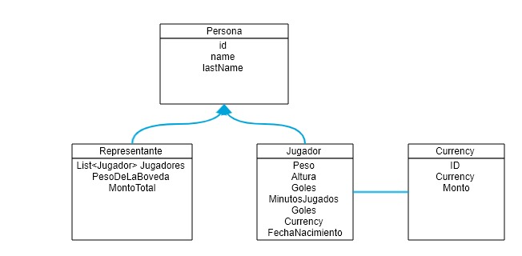

# ManagerCash - Primer parcial Laboratorio V 

### Volvimos a los 90 nuestro amigo personal Guillermo nos pide el favor que le hagamos un sistema para poder contar su dinero.
### Dado el siguiente DER
#### Desarrollar lo necesario para el correcto funcionamiento. Toda mejora fundamentada se tomara en cuenta.

* POST /person
* GET  /person
* GET  /person/{id}
* DEL  /person
* PUT  /person/{id}/jugadores/{idJugador} 

* POST /currency
* GET  /currency
* GET  /currency/{id}
* DEL  /currency

## Recuerden
* Respetar el estandar REST.
* El uso correcto de todo lo aprendido (inclusive, buenas practicas de laboratorio 3).
* Los jugadores que representa tienen valores en EUROS y DOLARES, pero nuestro amigo Guillermo actualmente esta en la Argentina con lo que necesita Pesos! asique el montoTotal debe ser calculado en Pesos.
* Cada Billete pesa 1 gramo.
